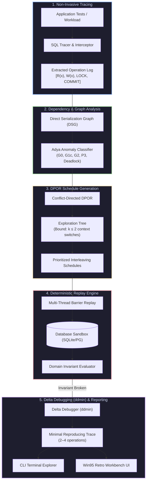
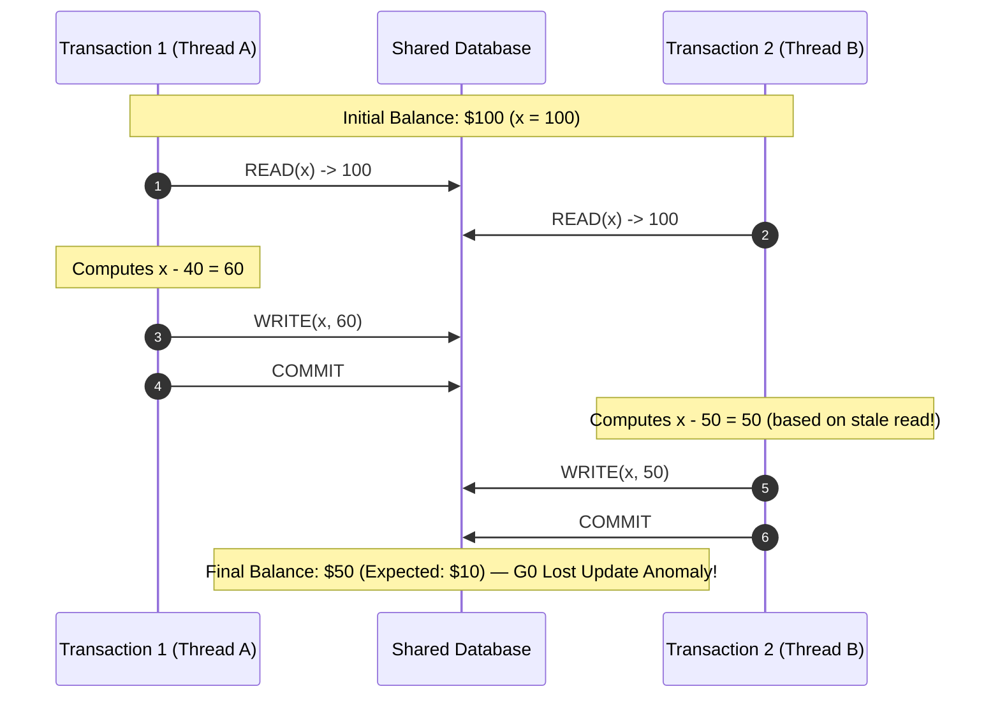

# DataRace — Automated Database Concurrency Bug Discovery & Minimal Reproduction Engine

<div align="center">

[](https://www.python.org/)
[](https://opensource.org/licenses/MIT)
[](tests/)
[](https://datarace-liard.vercel.app)
[](ui/)

<p align="center">
  <strong>Automated detection, deterministic replay, and delta-debugging reduction of application-level SQL race conditions and serializability violations.</strong>
</p>

[**Explore Live Web UI**](https://datarace-liard.vercel.app) • [**System Architecture**](#-system-architecture--workflow) • [**Quick Start**](#-quick-start) • [**Benchmarks**](#-canonical-benchmark-suite-10-real-world-cases) • [**Contributing**](CONTRIBUTING.md)

</div>

---

## ⚡ Executive Overview

**DataRace** is an automated database concurrency bug discovery and deterministic reproduction engine. Unlike generic database consistency fuzzers (such as Jepsen/Elle or Hermitage) which test whether the database engine itself complies with its isolation specification under network partitions, **DataRace targets application-level transaction bugs**.

In production web applications (FastAPI, Django, Rails, Spring Boot), 99% of concurrency catastrophes (overselling inventory, double-spending gift cards, booking races, lost account balances) happen when the underlying database is operating **completely correctly** under default isolation (such as PostgreSQL's default `READ COMMITTED`), but the **application business logic** makes invalid serializability assumptions.

DataRace bridges this gap by:
1. **Tracing Transactions Non-Invasively**: Capturing SQL queries, read/write item sets ($R(x), W(x)$), parameters, and transaction boundaries directly from application integration tests.
2. **Building the Direct Serialization Graph ($DSG$)**: Constructing Adya dependency edges ($ww, wr, rw$) and detecting cycles that prove isolation violations ($G0$ Lost Update, $G1c$ Inconsistent Read, $G2$ Write Skew).
3. **Conflict-Directed Dynamic Partial-Order Reduction (DPOR)**: Bounding context switches ($k \le 2$) and generating prioritized schedules that reverse conflicting operations without combinatorial explosion.
4. **Deterministic Multi-Thread Barrier Replay**: Forcing concurrent database connections into the exact candidate schedule using synchronization gates to guarantee 100% reproducible execution.
5. **Delta Debugging ($ddmin$) Schedule Minimization**: Pruning multi-thread executions down to the 2-to-4 operation minimal failing counterexample with actionable remediation advice.

---

## 📐 System Architecture & Workflow



### Concurrency Interleaving & Anomaly Sequence



---

## 🚀 Quick Start

### 1. Run Python Concurrency Benchmark Suite
```bash
# Run all 10 canonical concurrency benchmarks
python cli/main.py benchmark

# Explore conflict graph and DPOR schedules for a specific benchmark
python cli/main.py explore 01_banking_lost_update
```

### 2. Run Pytest Test Suite
```bash
python -m pytest
```

### 3. Launch Retro 90s Windows 95 Workbench UI
```bash
# Live deployment is available at https://datarace-liard.vercel.app
cd ui
npm install
npm run dev
```

### 4. Docker Environment
```bash
docker compose up --build
```

---

## 🔬 Mathematical Formalisms

### 1. Operations & Transactions
A transaction $T_i$ is a sequence of operations:
$$T_i = \langle o_{i,1}, o_{i,2}, \dots, o_{i,m} \rangle$$
where $o_{i,k} \in \{\text{BEGIN}, \text{READ}(x), \text{WRITE}(x), \text{LOCK}(x), \text{COMMIT}, \text{ABORT}\}$.

### 2. Dependency Relations (Adya Formalism)
- **Write-Write Dependency ($ww$)**: $T_i \xrightarrow{ww} T_j$ if $T_i$ writes version $x_u$ and $T_j$ overwrites it with $x_v$.
- **Write-Read Dependency ($wr$)**: $T_i \xrightarrow{wr} T_j$ if $T_i$ writes version $x_u$ and $T_j$ reads $x_u$.
- **Read-Write Anti-Dependency ($rw$)**: $T_i \xrightarrow{rw} T_j$ if $T_i$ reads version $x_u$ and $T_j$ overwrites $x_u$ with $x_v$.

### 3. Cycle Classification
- **Lost Update ($G0 / P4$)**: Cycle contains $rw$ and $ww$ edges targeting the same entity key.
- **Write Skew ($G2 / A5B$)**: Cycle contains $\ge 2$ $rw$ anti-dependencies on disjoint modified items.
- **Inconsistent Read ($G1c / P2$)**: Cycle contains mixed $wr$ and $rw$ edges.
- **Serializability ($SER$)**: $DSG(H)$ is strictly acyclic.

---

## 📊 Canonical Benchmark Suite (10 Real-World Cases)

| # | Benchmark Case | Category | Anomaly Type | Min Steps | Discovered In |
|---|---|---|---|---|---|
| **01** | `01_banking_lost_update` | Financial | Lost Update ($G0$) | 4 ops | 4.3ms |
| **02** | `02_ticket_double_booking` | E-Commerce | Double Allocation | 6 ops | 3.2ms |
| **03** | `03_coupon_reuse` | Promo Fraud | Promo Double-Spend | 6 ops | 2.3ms |
| **04** | `04_wallet_write_skew` | Banking | Write Skew ($G2$) | 6 ops | 2.3ms |
| **05** | `05_ecommerce_overselling` | Inventory | Overselling Race | 6 ops | 2.3ms |
| **06** | `06_phantom_read_budget` | Accounting | Phantom Insertion ($P3$) | 6 ops | 2.4ms |
| **07** | `07_transfer_deadlock` | Concurrency | Deadlock Cycle | 5 ops | 6.6ms |
| **08** | `08_job_queue_double_claim` | Task Queue | Double Claim | 6 ops | 1.7ms |
| **09** | `09_rate_limiter_bypass` | Security | Limit Overdraft | 6 ops | 2.0ms |
| **10** | `10_auction_bid_snooping` | Realtime | Stale Bid Overwrite | 4 ops | 3.1ms |

---

## 🛠️ Automated Remediation Guidelines

| Anomaly Pattern | Root Cause | Recommended Fix |
|---|---|---|
| **Lost Update ($G0$)** | Unlocked read followed by computed write | Use `SELECT ... FOR UPDATE` or atomic `UPDATE account SET balance = balance - :amount WHERE balance >= :amount` |
| **Write Skew ($G2$)** | Cross-row invariant verification without locking read set | Promote transaction to `SERIALIZABLE` or lock rows with shared/exclusive locks |
| **Double Booking / Allocation** | Unconstrained `SELECT` before `INSERT` | Use database uniqueness constraints or advisory locks |
| **Deadlock Cycle** | Inconsistent resource acquisition ordering | Enforce global lock ordering (e.g., sort account IDs before locking) |

---

## 🏛️ Project Directory Structure

```
datarace/
├── core/                   # Core data models: Transaction, Operation, ConflictEdge, Schedule
├── tracer/                 # Non-invasive SQL parser and SQLAlchemy / DB-API interception hooks
├── analyzer/               # Direct Serialization Graph (DSG) & Adya cycle anomaly detector
├── scheduler/              # Conflict-Directed Dynamic Partial-Order Reduction (DPOR) scheduler
├── replay/                 # Deterministic multi-thread barrier coordinator and sandbox runner
├── invariants/             # Declarative SQL & Python domain invariant engine
├── reducer/                # Delta Debugging (ddmin) transaction schedule minimizer
├── benchmarks/             # 10 canonical concurrency bug benchmarks with ground truth fixes
├── cli/                    # Rich developer command-line interface
├── tests/                  # Pytest automated test suite
├── ui/                     # Retro 90s Windows 95 Nostalgia Web Workbench (Vite + React)
├── export_ui_data.py       # Engine-to-UI data exporter
└── conftest.py             # Pytest configuration
```

---

## 📜 License
MIT License.
